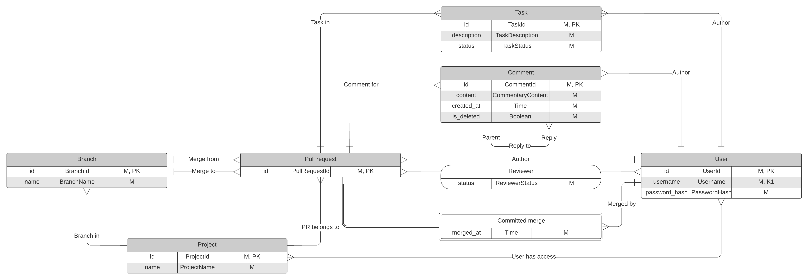
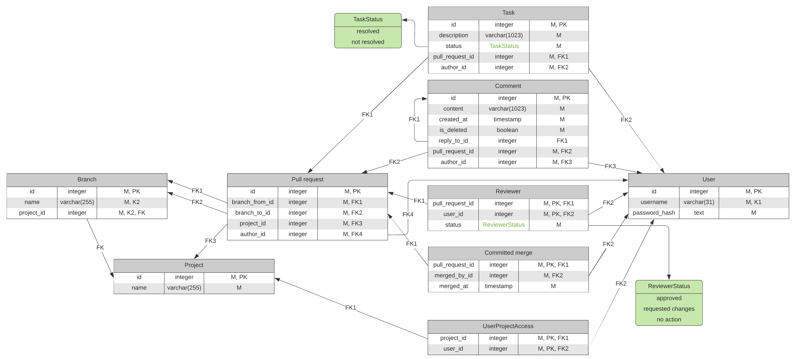

# Шарепо Виктор, M34391

### Сервия для review pull request`ов (GitHub)

### PSQL

# 1. ERM

TODO: description

# 2. Физическая модель

# 3. Функциональные зависимости

## 3.1. Branch (id, name, project_id)

1. id &rarr; name, project_id
2. name, project_id &rarr; id

## 3.2. Project (id, name)

1. id &rarr; name

## 3.3. Pull request (id, branch_from_id, branch_to_id, project_id, author_id)

1. id &rarr; branch_from_id, branch_to_id, project_id, author_id

## 3.4. Task (id, description, status, pull_request_id, author_id)

1. id &rarr; description, status, pull_request_id, author_id

## 3.5. Comment (id, content, created_at, is_deleted, reply_to_id, pull_request_id, author_id)

1. id &rarr; content, created_at, is_deleted, reply_to_id, pull_request_id, author_id

## 3.6. Reviewer (pull_request_id, user_id, status)

1. pull_request_id, user_id &rarr; status.

## 3.7. Committed merge (pull_request_id, merged_by_id, merged_at)

1. pull_request_id &rarr; merged_by_id, merged_at

## 3.8. User-project access (project_id, user_id)

Нетривиальные отсутствуют.

## 3.9. User (id, username, password_hash)

1. id &rarr; username, password_hash
2. username &rarr; id, password_hash

# 4. Нормализация

## 1-НФ

Все отношения уже находятся в 1-НФ, т.к. ни в одном нет повторяющихся групп, все атрибуты атомарны и в каждом есть ключ.

## 2-НФ

Все отношения уже находятся в 2-НФ, т.к. ни в одном из них нет ФЗ, где левая часть не является целым ключом. А значит
нет атрибутов зависящих от части ключа.

## 3-НФ

Все отношения уже находятся в 3-НФ, т.к. ни в одном из них нет ФЗ, где левая часть не является ключом. А значит все
атрибуты зависят от ключей напрямую.

## НФ Бойса-Кодда, 4-НФ, 5-НФ

### Теорема Дейта-Фейгина 1

Отношения Branch, Project, Pull request, Task, Comment, Committed merge, User уже находятся в 5-НФ по теореме
Дейта-Фейгина 1 (т.к. находятся в 3-НФ и все ключи простые).

### Отношение Reviewer

Отношение Reviewer (pull_request_id, user_id, status) уже находится в 4-НФ, т.к. не существует такой нетривиальной
многозначной зависимости, где левая часть не надключ. Переберем все варианты и приведем к каждому контрпример:

1. pull_request_id &#8608; user_id | status. Неверно, т.к. для одного pull request разные reviewer могут находиться в
   разных статусах (один approved, другой ещё нет).
2. user_id &#8608; pull_request_id | status. Неверно, т.к. один пользователь для разных pull request может находиться в
   разных статусах (для одного approved, для другого ещё нет).
3. status &#8608; pull_request_id | user_id. Неверно, т.к. пользователь не обязан быть reviewer у всех pull request, то
   есть он может иметь какой-то статус для одного pull request и не иметь никакого для другого.
4. &#8709; &#8608; pull_request_id | user_id, status. Неверно по рассуждениям аналогичным п. 3 (или 2).
5. &#8709; &#8608; user_id | pull_request_id, status. Неверно, т.к. разные могут быть reviewer для разных наборов pull
   request. Например, один пользователь является reviewer для pull request с id = 1, а второй нет.
6. &#8709; &#8608; status | pull_request_id, user_id. Неверно, т.к. pull_request_id, user_id &ndash; это ключ и если в
   отношении есть хотя бы 2 status, то множества пар (pull_request_id, user_id) для них не будут совпадать.

Это же отношение Reviewer (pull_request_id, user_id, status) уже находится в 5-НФ, т.к. не существует нетривиальной
зависимости соединения, где один из элементов не надключ. Переберем все варианты и приведем к каждому контрпример. ЗС,
где один из элементов &ndash; подмножество другого равнозначна зависимости с меньшим числом элементов, так что такие
рассматривать не будем. Также не будем рассматривать ЗС из двух элементов, т.к. мы уже доказали, что отношение находится
в 4-НФ, а такая ЗС равносильна многозначной зависимости.

1. {{pull_request_id}, {user_id}, {status}}. Не является ЗС, контрпример:

   | pull_request_id | user_id | status    |
   |-----------------|:--------|:----------|
   | 1               | 1       | approved  |
   | 2               | 2       | no action |

   В соединении будет 8 кортежей вместо 2 исходных.
2. {{pull_request_id, user_id}, {user_id, status}, {pull_request_id, status}}. Не является ЗС, контрпример:

   | pull_request_id | user_id | status    |
   |-----------------|:--------|:----------|
   | 1               | 1       | approved  |
   | 1               | 2       | no action |
   | 2               | 1       | no action |
   | 2               | 2       | approved  |

   В соединении будут лишние кортежи, например: (1, 1, no action).

### Отношение User-project access

Отношение User-project access (project_id, user_id) уже находится в 4-НФ, т.к. не существует такой нетривиальной
многозначной зависимости, где левая часть не надключ. Переберем все варианты и приведем к каждому контрпример:

1. &#8709; &#8608; project_id | user_id. Неверно, т.к. множество пользователей, у которых есть доступ, зависит от
   конкретного проекта. Например, у пользователя с id = 1 может быть доступ к проекту с id = 1, но не быть к проекту с
   id = 2

Это же отношение User-project access (project_id, user_id) уже находится в 5-НФ, т.к. не существует нетривиальной
зависимости соединения, где один из элементов не надключ. Аналогично с предыдущим пунктом, можно не рассматривать ЗС
размера 2 и ЗС, в которых один элемент является подмножеством другого. А других нетривиальных ЗС на отношении из двух
атрибутов быть не может.